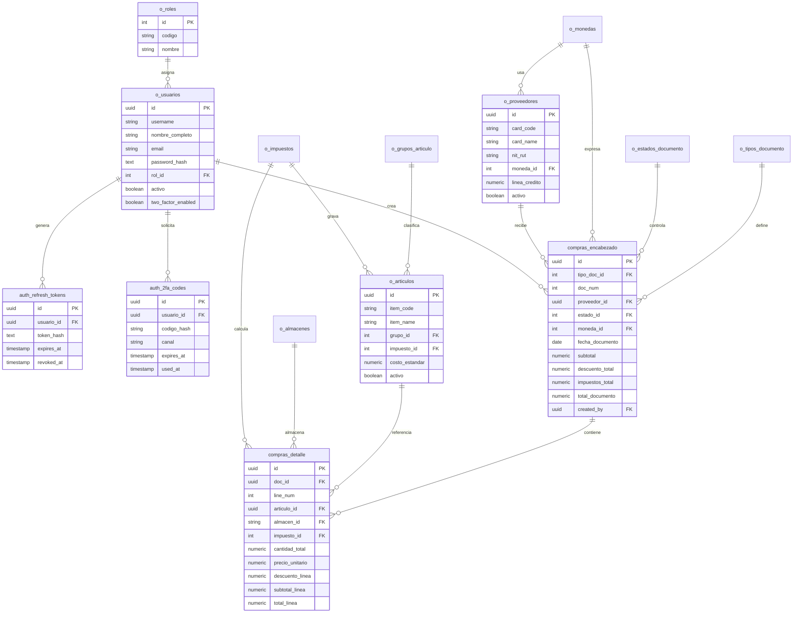

# Diagrama de Base de Datos

## Notas de defensa

- El modelo es relacional y esta normalizado alrededor de catalogos maestros.
- `compras_encabezado` y `compras_detalle` representan el documento de compra y sus lineas.
- `auth_refresh_tokens` y `auth_2fa_codes` permiten seguridad avanzada sin mezclar esos datos con la tabla de usuarios.
- Los catalogos `o_monedas`, `o_impuestos`, `o_grupos_articulo`, `o_tipos_documento` y `o_estados_documento` simplifican validaciones y demostracion.
